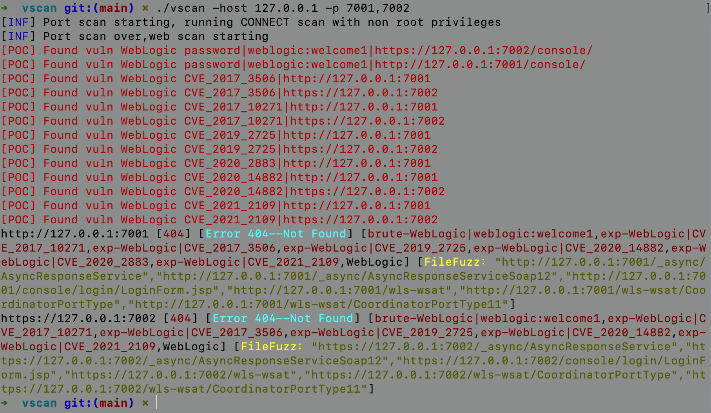

vscan
================================
开源、轻量、快速、跨平台 的网站漏洞扫描工具，帮助您快速检测网站安全隐患。

<a href="https://github.com/veo/vscan/issues"></a>
[](https://github.com/veo/vscan/releases/latest)


# 1.options
```
Examples:
 ./vscan -l hosts.txt -top-ports http -o out.txt -local-jndi  xxx.xxx.xxx.xxx:1234 -ceyeapi xxx -ceyedomain xxxxxx.ceye.io

Usage:
  ./vscan [flags]

INPUT:
   -host string                Host to scan ports for (url/domain/ip/cidr)
   -list, -l string            File containing list of hosts to scan ports (url/domain/ip/cidr)
   -exclude-hosts, -eh string  Specifies a comma-separated list of targets to be excluded from the scan (ip, cidr)
   -exclude-file, -ef string   Specifies a newline-delimited file with targets to be excluded from the scan (ip, cidr)

PORT:
   -port, -p string            Ports to scan (80, 80,443, 100-200)
   -top-ports, -tp string      Top Ports to scan (full/http/top-100/top-1000) (default http)
   -exclude-ports, -ep string  Ports to exclude from scan
   -ports-file, -pf string     File containing ports to scan for
   -exclude-cdn, -ec           Skip full port scans for CDNs (only checks for 80,443)

RATE-LIMIT:
   -c int     General internal worker threads (default 25)
   -rate int  Rate of port scan probe request (default 1000)

OUTPUT:
   -o, -output string  File to write output to (optional)
   -json               Write output in JSON lines Format

CONFIGURATION:
   -proxy                 Httpx Proxy, eg (http://127.0.0.1:8080|socks5://127.0.0.1:1080)   
   -skip-admin-brute      Skip brute admin password
   -local-jndi            Local Jndi Server and Port (eg: 8.8.8.8:1234，如需外网访问，IP请填写外网IP)
   -ceyeapi               ceye.io api key  //扫描时最好添加dnslog，有些漏洞检测需要dnslog验证
   -ceyedomain            ceye.io subdomain  //扫描时最好添加dnslog，有些漏洞检测需要dnslog验证
   -no-color              Don't Use colors in output	
   -scan-all-ips          Scan all the ips
   -scan-type, -s string  Port scan type (SYN/CONNECT) (default s)
   -source-ip string      Source Ip
   -interface-list, -il   List available interfaces and public ip
   -interface, -i string  Network Interface to use for port scan
   -r                     Custom resolvers to use to resolve DNS names (comma separated or from file)
   -nmap                  Invoke nmap scan on targets (nmap must be installed)
   -nmap-cli string       nmap command to run on found results (example: -nmap-cli 'nmap -sV')

OPTIMIZATION:
   -retries int       Number of retries for the port scan probe (default 3)
   -timeout int       Millisecond to wait before timing out (default 1000)
   -warm-up-time int  Time in seconds between scan phases (default 2)
   -ping              Use ping probes for verification of host
   -verify            Validate the ports again with TCP verification

DEBUG:
   -debug          Enable debugging information
   -no-color, -nc  Don't Use colors in output
   -silent         Show found ports only in output
   -version        Show version of naabu
   -stats          Display stats of the running scan
```

# 2.Build

Requirements:
* [Go 1.15 版本以上](https://golang.org/dl/)
* [libpcap](https://www.tcpdump.org/)
```
git clone https://github.com/veo/vscan.git
cd vscan
go build
```

# 3.功能
### 3.1 端口扫描，站点访问

1.支持CONNECT、SYN扫描

2.支持四种模式的输入，完整链接（子目录）/域名地址/IP/C段

3.支持CDN检测，使用-exclude-cdn参数检测到CDN会只扫描80,443端口

4.智能识别https，自动信任证书

其他功能自行探索，详情见options

### 3.2 指纹识别
3.2.1 基础指纹识别

可以快速识别网站的标题、网址、状态码、指纹等

使用了wappalyzergo库作为指纹识别，[wappalyzergo](https://github.com/projectdiscovery/wappalyzergo)库已集成在源码内，详情见./pkg/httpx/fingerprint/fingerprints_data.go

3.2.2 智能探索型指纹识别

基于敏感文件扫描，扫描到某些文件，再进行指纹鉴定，详情见./brute/fuzzfingerprints.go

### 3.3 漏洞检测
<details>
<summary>已支持的漏洞列表 [点击展开] </summary>  

```
pocs_go:

 +-------------------+------------------+-------------------------------------------------------------+
 | 系统               | 编号             | 描述                                                         |
 +-------------------+------------------+-------------------------------------------------------------+
 | Apache Log4j      | CVE-2021-44228   | 2.0 <= Apache log4j2 <= 2.14.1, log4j remote code execution |
 | Apache Shiro      | CVE-2016-4437    | <= 1.2.4, shiro-550, rememberme deserialization rce         |
 | Apache Tomcat     | CVE-2017-12615   | 7.0.0 - 7.0.81, put method any files upload                 |
 | Apache Tomcat     | CVE-2020-1938    | 6, 7 < 7.0.100, 8 < 8.5.51, 9 < 9.0.31 arbitrary file read  |
 | Fsatjson          | VER-1262         | <= 1.2.62 fastjson autotype remote code execution           |
 | Jboss             | CVE_2017_12149   | Jboss AS 5.x/6.x rce                                        |
 | Jenkins           | CVE-2018-1000110 | user search                                                 |
 | Jenkins           | CVE-2018-1000861 | <= 2.153, LTS <= 2.138.3, remote code execution             |
 | Jenkins           | CVE-2018-1003000 | Groovy <= 2.61 Script Security <= 1.49 remote code execution|
 | Jenkins           | Unauthorized     | Unauthorized Groovy script remote code execution            |
 | Oracle Weblogic   | CVE-2014-4210    | 10.0.2 - 10.3.6, weblogic ssrf vulnerability                |
 | Oracle Weblogic   | CVE-2017-3506    | 10.3.6.0, 12.1.3.0, 12.2.1.0-2, weblogic wls-wsat rce       |
 | Oracle Weblogic   | CVE-2017-10271   | 10.3.6.0, 12.1.3.0, 12.2.1.1-2, weblogic wls-wsat rce       |
 | Oracle Weblogic   | CVE-2018-2894    | 12.1.3.0, 12.2.1.2-3, deserialization any file upload       |
 | Oracle Weblogic   | CVE-2019-2725    | 10.3.6.0, 12.1.3.0, weblogic wls9-async deserialization rce |
 | Oracle Weblogic   | CVE-2019-2729    | 10.3.6.0, 12.1.3.0, weblogic wls9-async deserialization rce |
 | Oracle Weblogic   | CVE-2020-2883    | 10.3.6.0, 12.1.3.0, 12.2.1.3-4, iiop t3 deserialization rce |
 | Oracle Weblogic   | CVE-2020-14882   | 10.3.6.0, 12.1.3.0, 12.2.1.3-4, 14.1.1.0, console rce       |
 | Oracle Weblogic   | CVE-2020-14883   | 10.3.6.0, 12.1.3.0, 12.2.1.3-4, 14.1.1.0, console rce       |
 | Oracle Weblogic   | CVE-2021-2109    | 10.3.6.0, 12.1.3.0, 12.2.1.3-4, 14.1.1.0, unauthorized jndi |
 | PHPUnit           | CVE_2017_9841    | 4.x < 4.8.28, 5.x < 5.6.3, remote code execution            |
 | Seeyon            | *                | some poc                                                    |
 | ThinkPHP          | CVE-2019-9082    | < 3.2.4, thinkphp remote code execution                     |
 | ThinkPHP          | CVE-2018-20062   | <= 5.0.23, 5.1.31, thinkphp remote code execution           |
 +-------------------+------------------+-------------------------------------------------------------+
pocs_yml:

xray all pocs

```
</details>

#### 自行添加POC方式:

##### go文件添加POC：

1.在 ./pkg/httpx/fingerprint/fingerprints_data.go 内检查或添加指纹

2.写一个go文件POC，放到pocs_go文件夹下，指定一个入口函数，指定输入输出，并在./pocs_go/go_poc_check.go 添加检测项（poc的编写过程可以使用./pkg/util.go内的函数pkg.HttpRequset）

例如：

CVE_2017_12615 POC：
```
func CVE_2017_12615(url string) bool {
	if req, err := pkg.HttpRequset(url+"/vtset.txt", "PUT", "test", false, nil); err == nil {
		if req.StatusCode == 204 || req.StatusCode == 201 {
			pkg.POClog(fmt.Sprintf("Found vuln Tomcat CVE_2017_12615|--\"%s/vtest.txt\"\n", url))
			return true
		}
	}
	return false
}
```

CVE_2017_12615 POC ./pocs_go/go_poc_check.go 添加检测项：
```
case "Apache Tomcat":
   if tomcat.CVE_2017_12615(URL) {
		technologies = append(technologies, "exp-Tomcat|CVE_2017_12615")
    }
```
##### yml文件添加POC：
1.在 ./pkg/httpx/fingerprint/fingerprints_data.go 内检查或添加指纹

2.参考 xray yml 的编写方式编写放至 ./pocs_yml/ymlFiles/ 下

## 3.4 智能后台弱口令扫描，中间件弱口令扫描

后台弱口令检测内置了两个账号 admin/test，密码为top100，如果成功识别首页有登录会标记为 LoginPage，如果识别可能是后台登录页会标记为 AdminLoginPage ，都会尝试构建登录包会自动检测弱口令

如：

`http://127.0.0.1:8080 [302,200] [登录 - 后台] [exp-shiro|key:Z3VucwAAAAAAAAAAAAAAAA==,Java,LoginPage,brute-admin|admin:123456] [http://127.0.0.1:8080/login]`

包含弱口令检测板块
1. 没有使用验证码，没有使用vue等前端框架的后台智能弱口令检测
2. basic弱口令检测
3. tomcat弱口令检测
4. weblogic弱口令检测
5. jboss弱口令检测

## 3.5 敏感文件扫描

扫描 备份、swagger-ui、spring actuator、上传接口、测试文件等敏感文件，字典在 ./brute/dicts.go 内置，可自行修改

## 3.6 JNDILOG

JNDI漏洞支持两种验证方式、

1.本机-local-jndi参数启动JNDIlog进行验证

2.外网DNSLOG验证

如两个参数都使用，GOPOC使用JNDILOG进行，YMLPOC还是会使用DNSLOG。

总结：建议扫描时使用 JNDILOG 功能的同时使用 DNSLOG

## Licenses

本工具仅面向合法授权的企业安全建设行为，在使用本工具进行检测时，您应确保该行为符合当地的法律法规，并且已经取得了足够的授权。

如您在使用本工具的过程中存在任何非法行为，您需自行承担相应后果，作者将不承担任何法律及连带责任。

在使用本工具前，请您务必审慎阅读、充分理解各条款内容，限制、免责条款或者其他涉及您重大权益的条款可能会以加粗、加下划线等形式提示您重点注意。 除非您已充分阅读、完全理解并接受本协议所有条款，否则，请您不要使用本工具。您的使用行为或者您以其他任何明示或者默示方式表示接受本协议的，即视为您已阅读并同意本协议的约束。 
