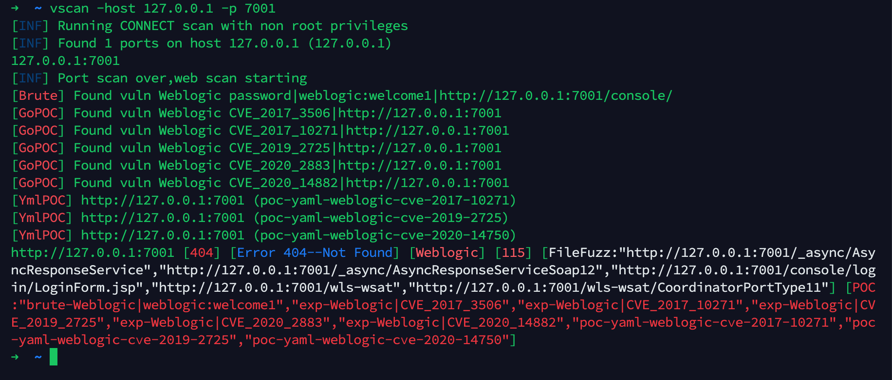

<p align="center">开源、轻量、快速、跨平台 的网站漏洞扫描工具，帮助您快速检测网站安全隐患。</p>

<p align="center">
<a href="https://github.com/hktalent/scan4all/issues"></a>
<a href="https://github.com/hktalent/scan4all"></a>
<a href="https://github.com/hktalent/scan4all/releases"></a>
<a href="https://github.com/hktalent/scan4all/releases"></a>
</p>

<p align="center">
  <a href="/static/Installation.md">编译/安装/运行</a> •
  <a href="/static/usage.md">参数说明</a> •
  <a href="/static/running.md">使用方法</a> •
  <a href="/static/scenario.md">使用场景</a> •
  <a href="/static/pocs.md">POC列表</a> •
  <a href="/static/development.md">自定义扫描器</a>
</p>

# Features

<h1 align="center">
  </a>
  <br>
</h1>

- 快速的端口扫描、指纹探测功能
- 快速的登录密码爆破功能
- 快速的POC检测功能
- 快速的敏感文件检测功能
- 轻量、开源、跨平台使用
- 支持多种类型的输入 - **STDIN/HOST/IP/CIDR/URL/TXT**
- 支持多种类型的输出 - **JSON/TXT/CSV/STDOUT**
## 通过配置文件、环境变量 控制的新特性
- 带上下文路径的url列表，开启精准扫描 UrlPrecise=true ./main -l xx.txt
- 开启智能的子域名遍历, export EnableSubfinder=true
- 自动识别一个domain(DNS)关联多个ip的情况，自动对关联的多个ip进行扫描
- 预处理，列表中多个域名相同的ip时，端口扫描合并处理，从而提高效率
- 深度分析、自动化关联扫描：自动获取ssl中域名信息，针对*.xxx.com这种情况，且配置了允许自动子域名遍历，将自动完成子域名遍历，并将目标添加到扫描列表中
- 输入target（目标）是ip时，自动从51pwn云端赋能关联所有域名、指纹信息、历史端口信息，并进行处理（云端服务功能需要授权）
- 自动化供应链分析及扫描，该项功能需要授权才可用

# 执行流程
- 1、【端口扫描]集成了naabu（2.1k），大名顶顶的nuclei官方出品
- 2、【服务识别]naabu调用系统安装的nmap，请自己先安装nmap
- 3、【指纹识别】nmap + 集成、并优化了EHole（1.4k），后期将持续集成更多指纹识别
- 4、【web扫描】集成了httpx（3.2k）,大名顶顶的nuclei官方出品
- 5、【漏洞扫描】
   * 集成了nuclei（8.6k）+ nuclei-templates(4.5k优化版本，https://github.com/hktalent/nuclei-templates)
   * 集成了xray 2.0（6.9k）,共354个POC
   * vscan自身实现了8个fuzz组件，同时实现集成了14类常见组件的漏洞检测

# How use
使用前请自行先安装nmap
```bash
go build -o vscan main.go
# 精准扫描 UrlPrecise=true
UrlPrecise=true ./main -l xx.txt
```

# changelog
- 2022-06-20 集成了Subfinder，做子域名爆破，启动参数export EnableSubfinder=true，注意，启动后很慢
- 2022-06-17 优化一个域名多个ip的情况，所有ip都会被端口扫描，然后走后续的扫描流程
- 2022-06-15 该版本增加了若干过去实战中获得的weblogic密码字典，以及webshell字典
- 2022-06-10 完成nuclei的集成，当然也包含nuclei模版的集成
- 2022-06-07 增加了相似度算法对404检测
- 2022-06-07 增加了http url清单精准扫描参数,基于环境变量UrlPrecise=true 开启

