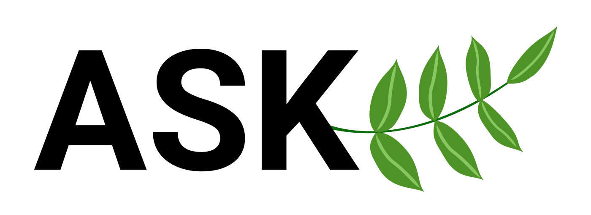

<p align="center">

<br/>
<a href="https://pkg.go.dev/github.com/simonnilsson/ask"></a>
<a href="https://goreportcard.com/report/github.com/simonnilsson/ask"></a>
<a href="https://raw.githack.com/wiki/simonnilsson/ask/coverage.html"></a>
<a href="https://github.com/avelino/awesome-go#json"></a>  
<br/>
and you shall receive.
</p>
Ask provides a simple way of accessing nested properties in maps and slices. Works great in combination with encoding/json and other packages that "Unmarshal" arbitrary data into Go data-types. Inspired by the get function in the lodash javascript library.
<br/><br/>
:warning: From version `v0.3.0`, the package requires [Go 1.17+](https://golang.org/doc/install), due to the usage of new additions to the reflect package.

## Use

```go
package main

import "json"
import "github.com/simonnilsson/ask"

func main() {

	// Use parsed JSON as source data
	var object map[string]interface{}
	json.Unmarshal([]byte(`{
		"a": [{ 
			"b": { 
				"c": 3 
			} 
		}] 
	}`), &object)

	// Extract the 3
	res, ok := ask.For(object, "a[0].b.c").Int(0)

	fmt.Println(res, ok)
	// Output: 3 true

	// Attempt extracting a string at path .d that does not exist
	res2, ok := ask.ForArgs(object, "a", 0, "b", "d").String("nothing")

	fmt.Println(res2, ok)
	// Output: nothing false

}
```

## API

Internally ask uses type assertions to traverse down the path supplied. Each invocation starts by calling For() with your data structure **source** and the **path** in this structure to extract. You can also use ForArgs() if want to supply each part of the path as a seperate argument, this can be usefull if your field names contain dots for example. The same accessors used in For can be used in ForArgs, but ForArgs can also take integers for slice indexes.

```go
For(source interface{}, path string) *Answer
ForArgs(source interface{}, parts ...interface{}) *Answer
```
Additional paths can be traversed by calling Path()/PathArgs() on the resulting answer.
```go
(a *Answer) Path(path string) *Answer
(a *Answer) PathArgs(parts ...interface{}) *Answer
```


### Type assertion

After receiving an `*Answer` from a call to For() it can be asserted to a type. The methods for this is seen below. Each function takes a default value as a parameter that will be returned in case the value can not be asserted from the answer. A second return value is used to indicate if the assertion was successful.

```go
(a *Answer) String(d string) (string, bool)
(a *Answer) Bool(d bool) (bool, bool)
(a *Answer) Int(d int64) (int64, bool)
(a *Answer) Uint(d uint64) (uint64, bool)
(a *Answer) Float(d float64) (float64, bool)
(a *Answer) Slice(d []interface{}) ([]interface{}, bool)
(a *Answer) Map(d map[string]interface{}) (map[string]interface{}, bool)
```

If a number is found but it is of different type than requested it will be casted to desired type and return success. If the value would not fit within the valid range of requested type the operation will fail however and the default parameter will be returned instead.

Two additional methods are available, one to check if the answer has a value (not nil) and one to return the raw value as a interface{}.

```go
(a *Answer) Exists() bool
(a *Answer) Value() interface{}
```

For full documentation see [pkg.go.dev](https://pkg.go.dev/github.com/simonnilsson/ask).

## License

[MIT](LICENSE)